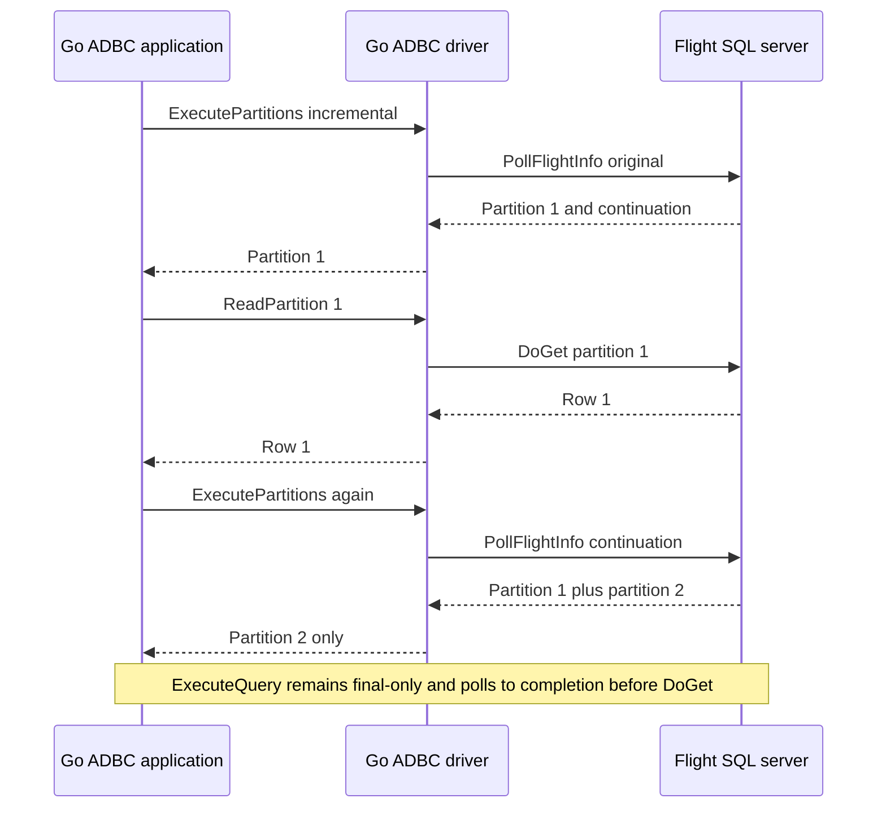

# BDX-645 Go ADBC PollInfo feasibility report

## Outcome

Go ADBC already has the right API split. Normal Flight SQL `ExecuteQuery` synchronously drains `PollFlightInfo` to completion, while opt-in incremental `ExecutePartitions` returns newly published endpoints across repeated calls so applications can download partitions before query completion. The POC preserves that split, adds append-only validation and cancellation cleanup to the incremental path, and does not change an ADBC public method, signature, or result type.

**Verdict: Feasible transparently** through the existing API-specific split.

## Repository baseline

- Repository: `/Users/helder/Documents/Codex/2026-09-10/bdx-645-pollinfo-orchestrator/workstreams/arrow-adbc`
- Upstream: `https://github.com/apache/arrow-adbc.git`
- Upstream revision: `4d50e2e30f9e96905a64644defe964447d54cbe7`
- Initial branch/status: `main...origin/main`, clean
- Experimental branch: `bdx-645-pollinfo-poc`
- Review branch: `xborder/arrow-adbc` PR #2.
- Toolchain: Go `1.25.5 darwin/arm64`; Git `2.50.1 (Apple Git-155)`
- Baseline log: `reports/raw/baseline.log`

## Design demonstrated

`connectionImpl.pollToCompletion` remains the synchronous loop for normal `ExecuteQuery` and metadata. It sends the original descriptor only on the initial poll, follows continuations with one caller context, and returns the final `FlightInfo` to the existing reader. It intentionally does not consume partial endpoints.

Polling is enabled by default. `adbc.flight.sql.rpc.use_poll_flight_info=disabled` is accepted as a database option and, secondarily, through the public connection `GetSetOptions` surface. A physical `connectionImpl` owns a concurrency-safe unsupported-family map. Only an initial gRPC `UNIMPLEMENTED` adds an entry. SQL, Substrait, prepared, catalogs, DB schemas, tables, table types, and SQL info are independent cache keys.

Direct SQL and Substrait reuse Arrow Go's `ExecutePoll`/`ExecuteSubstraitPoll`; prepared queries reuse `PreparedStatement.ExecutePoll`. Arrow Go v18.8.0 lacks typed polling helpers for metadata, so the POC serializes the same standard Flight SQL protobuf command descriptor and invokes the underlying standard `PollFlightInfo` RPC.

Prepared binding happens inside Arrow Go's initial `ExecutePoll`. The POC mirrors the bound record/reader at statement scope so an initial-unsupported fallback can temporarily clear the already-applied Arrow Go binding, issue exactly one `GetFlightInfo`, and restore the binding for later statement reuse. Shared-server evidence records one bind for both the multi-poll success path and the unsupported fallback path.

The statement query timeout creates one context/deadline outside the loop. Every poll and an initial-unsupported fallback share it. The focused two-poll test proves the second poll receives only the remaining operation time, while shared T8 proves the active gRPC poll terminates. Caller context cancellation is preserved. If a prior cumulative `FlightInfo` exists, cancellation launches a detached best-effort `CancelFlightInfo` attempt using copied request metadata and a hard one-second context bound. The goroutine captures the Flight client rather than reading `connectionImpl.cl` later; concurrent gRPC client close can only make the bounded attempt fail, not leave it alive indefinitely or delay the caller.

## Execution-path coverage

The complete file/method/family/applicability table is in `reports/call-site-inventory.md`. It explicitly includes the `Database.Open` transaction-support `GetSqlInfo` probe. Shared test `DatabaseOpenTransactionProbe` records three metadata polls, one original, two continuations, and zero gets.

Go ADBC `GetObjects` does not invoke primary-key, foreign-key, cross-reference, or XDBC-type-info helpers. It constructs its hierarchy from catalogs, DB schemas, and tables. The similarly named Arrow Go APIs therefore are not hidden ADBC call sites.

`ExecutePartitions` remains separate from synchronous reader routing. With `OptionKeyIncremental` enabled, it returns new endpoints per call and retains continuation/progress state. The POC now validates that every cumulative response retains the previously published endpoint prefix, returns only the appended suffix, observes context cancellation during backoff or polling, and sends best-effort `CancelFlightInfo` when an active incremental call is cancelled or the statement is closed between calls. With incremental mode disabled, the legacy partition path is unchanged.

## Request flow



Repeated incremental calls expose only appended partitions. A late error is returned by the next `ExecutePartitions` call. Active-call context cancellation and statement close between calls attempt best-effort server cancellation. Normal `ExecuteQuery` retains its existing final-only result-reader contract.

## T1-T10 results

| Test | Status | Executable result |
| --- | --- | --- |
| T1 immediate | PASS | Public `ExecuteQuery` returned `(immediate,1)` and `(immediate,2)`; poll 1, get 0, original 1, DoGet 1. |
| T2 progressive multi-step | PASS | Incremental `ExecutePartitions` produced one new partition per call, and each partition was read before the next continuation: `Poll, DoGet, Poll, DoGet, Poll, DoGet`. A separate assertion proves `ExecuteQuery` remains final-only: all three polls precede its three `DoGet` calls. |
| T3 prepared | PASS | Multi-step prepared result returned bound-derived 41/42 with bind 1, original 1, polls 3. Initial-unsupported prepared fallback separately returned 7/8 with bind 1, poll 1, get 1. |
| T4 metadata | PASS | Public catalog-depth `GetObjects` returned `bdx_catalog`; polls 3, continuations 2, get 0. |
| T5 fallback/cache | PASS | First direct call poll 1/get 1; matching second call skipped poll/get 1; catalogs independently polled three times. |
| T6 opt-out | PASS | Connection-level disable produced poll 0/get 1 and unchanged rows. |
| T7 non-fallback and late failure | PASS | Initial `UNAVAILABLE` surfaces without fallback. After one incremental partition is read, a deterministic late failure is returned by the next `ExecutePartitions` call; no re-execution occurs. |
| T8 timeout | PASS | Focused two-poll deadline test and real blocked server both terminated on one operation deadline; no fallback; server active termination 1. |
| T9 cancellation and close | PASS | Context cancellation during the second incremental call terminates the active poll and attempts `CancelFlightInfo`; closing the statement after the first partition also attempts cancellation. |
| T10 regression | PASS | Flight SQL package: 284 pass. Shared conformance: 14 subtests pass, including both incremental and final-only T2 traces. |

Machine-readable records are in `reports/evidence.jsonl`; detailed counters and command output are in `reports/raw/`.

## Shared-server validation

The independent fixture at `/Users/helder/Documents/Codex/2026-09-10/bdx-645-pollinfo-orchestrator/workstreams/conformance-server` was used read-only. It had no Git `HEAD` yet and all files were staged/added on its independent `bdx-645-conformance-server` workstream, so the exact state—not an invented revision—is recorded in `reports/raw/shared-server-build.log`.

Commands:

```text
make build
./bin/conformance-server -flight-addr 127.0.0.1:31337 -control-addr 127.0.0.1:31338
ADBC_POLL_CONFORMANCE_URI=grpc+tcp://127.0.0.1:31337 \
ADBC_POLL_CONFORMANCE_CONTROL=http://127.0.0.1:31338 \
go test ./driver/flightsql -run '^TestPollInfoSharedConformance$' -count=1 -v
```

The test talks only through public ADBC APIs plus the fixture's documented reset/control/observation HTTP API. It passed every subtest, including a separate `Database.Open` check and the additional prepared-fallback bind-once check. The same conformance test passed under Go's race detector.

## Regression and limitations

The final driver command `go test ./driver/flightsql -count=1` passed 284 tests. The incremental suite covers direct, prepared, transaction, descriptor-change, prefix mutation, no-progress, progress/app-metadata, completion, and transient-`UNAVAILABLE` behavior. The shared suite additionally proves partial consumption, late failure, active-call cancellation, statement-close cancellation, and the unchanged final-only `ExecuteQuery` ordering.

Repository-wide `go test ./... -count=1` ran 403 passing tests, skipped 13, and failed three unrelated tests in `sqldriver`/`drivermgr`. Each requires an externally installed `adbc_driver_sqlite`/`libadbc_driver_sqlite.dylib`; `ADBC_DRIVER_PATH` is unset and neither platform manifest directory exists. Reproduction and full loader diagnostics are in `reports/raw/regression.log`. No failing package imports the Flight SQL implementation.

The shared fixture deliberately supports direct statements, prepared statements, and catalogs metadata. Substrait and the remaining inventoried metadata commands therefore have focused driver regression/fallback coverage but no shared multi-step black-box case. This is a fixture scope limitation, not a wire/API limitation; they use either Arrow Go's typed Substrait poll helper or the same generic standard-command adapter proven by catalogs.

This is a feasibility patch, not production hardening. It does not add adaptive no-change backoff, cancellation telemetry, or lifecycle accounting for the bounded detached cancellation attempt. The server is expected to long-poll, as required by the frozen contract.

## Smallest production follow-up

### Arrow Go / shared Flight SQL

1. Add an exported generic command-to-descriptor PollFlightInfo helper, or typed polling methods for the metadata commands, so ADBC need not duplicate standard descriptor serialization.
2. Add a prepared execution primitive that exposes the post-bind descriptor or supports an initial-poll-unsupported GetFlightInfo fallback without temporarily clearing/restoring client binding state.
3. Add shared Arrow Go tests for a single operation deadline across continuations and for CancelFlightInfo after a successful partial poll.

### Go ADBC integration / hardening

1. Land the per-physical-connection family cache and connection option with final naming/docs and telemetry for poll, fallback, cached bypass, and cancellation outcomes.
2. Add production tracing attributes for continuation count/final cumulative info and bounded cancellation completion; optionally account for in-flight best-effort cancellation workers during close while preserving prompt caller return.
3. Extend integration coverage to a real Substrait-capable server and the other metadata commands, and run the repository-wide suite in an environment containing the SQLite ADBC driver.

## Changed files and artifacts

Production/test source:

- `go/adbc/driver/flightsql/poll.go`
- `go/adbc/driver/flightsql/flightsql_driver.go`
- `go/adbc/driver/flightsql/flightsql_database.go`
- `go/adbc/driver/flightsql/flightsql_connection.go`
- `go/adbc/driver/flightsql/flightsql_statement.go`
- `go/adbc/driver/flightsql/poll_test.go`
- `go/adbc/driver/flightsql/poll_conformance_test.go`
- `go/adbc/driver/flightsql/flightsql_adbc_server_test.go` (fixture correction: generic continuation handler returns `UNIMPLEMENTED` for unrelated initial command descriptors)

Evidence/deliverables:

- `reports/go-adbc-report.md`
- `reports/evidence.jsonl`
- `reports/call-site-inventory.md`
- `reports/raw/baseline.log`
- `reports/raw/shared-server-build.log`
- `reports/raw/shared-conformance.log`
- `reports/raw/incremental-regression.log`
- `reports/raw/timeout-unit.log`
- `reports/raw/regression.log`
- `reports/experimental.patch`

The experimental patch is generated from the complete source/test diff. Reports are intentionally kept as adjacent uncommitted evidence rather than embedded recursively in that patch.
